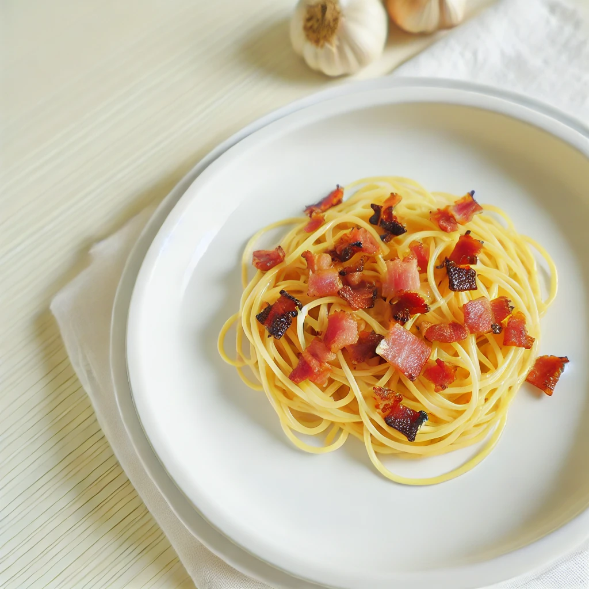

# [githubpages_instruction](https://tom-atok.github.io/githubpages_instruction/)
# ズボラなーら（ズボラなカルボナーラ）レシピ

## はじめに

[カルボナーラ](https://ja.wikipedia.org/wiki/%E3%82%AB%E3%83%AB%E3%83%9C%E3%83%8A%E3%83%BC%E3%83%A9)はイタリア料理の定番ですが、忙しい人や料理が苦手な人でも簡単に作れる「ズボラなーら（ズボラなカルボナーラ）」をご紹介します。このレシピなら手間をかけずに美味しいパスタを楽しめます。

私がズボラなーらに込めた想いは[こちら](./origin.md)

## 必要な材料

- パスタ 100g
- ベーコン 50g
- ニンニク 1片
- 卵 1個
- 粉チーズ 大さじ2
- オリーブオイル 大さじ1
- 塩 適量
- コショウ 適量

## 手順

1. パスタを電子レンジで茹でる
    - 耐熱容器にパスタとパスタが浸るくらいの水、塩ひとつまみを入れます。
    - ラップをして電子レンジでパスタの表示時間＋2分加熱します。

1. ベーコンとガーリックを炒める
    - ベーコンを食べやすい大きさに切り、ニンニクをみじん切りにします。
    - フライパンにオリーブオイルを熱し、ベーコンの旨みとニンニクの香りをオイルに移します。

1. ソースを準備する
    - ボウルに生卵と粉チーズを入れます。
      - この時にはまだ卵を混ぜないでください！
    - コショウで味を調えます（塩はベーコンとチーズの塩分があるので控えめに）。

1. パスタとソースを合わせる
    - 茹で上がったパスタの水気を切り、熱々のままボウルに入れます。
    - パスタの余熱で卵に軽く火を通しながら、全体をよく混ぜます。

1. 仕上げ
    - パスタをお皿に盛り付け、上から炒めたベーコンとガーリックを乗せます。
    - お好みで追加の粉チーズやコショウを振りかけて完成です。

## 補足

### さらに美味しくするコツ

- カツオの顆粒出汁をソースに入れると和風な味わいになります
- 生卵を使用するので、新鮮な卵を使うと安心です。
- オイルにパスタの茹で汁を少し入れると、パスタとよくなじみます。
- 新鮮なパセリを刻んで散らす
- ホールブラックペッパーをミルでかけるとより風味が際立ちます

### さらにズボラにするコツ

- 正直、フライパンなしで具材なしでも美味しいです。

## 終わりに

この「ズボラなーら」で、手軽に本格的なカルボナーラの味を楽しんでみてください。作ってみたよと言う人はぜひ`@Tom-atok`にご連絡ください！
