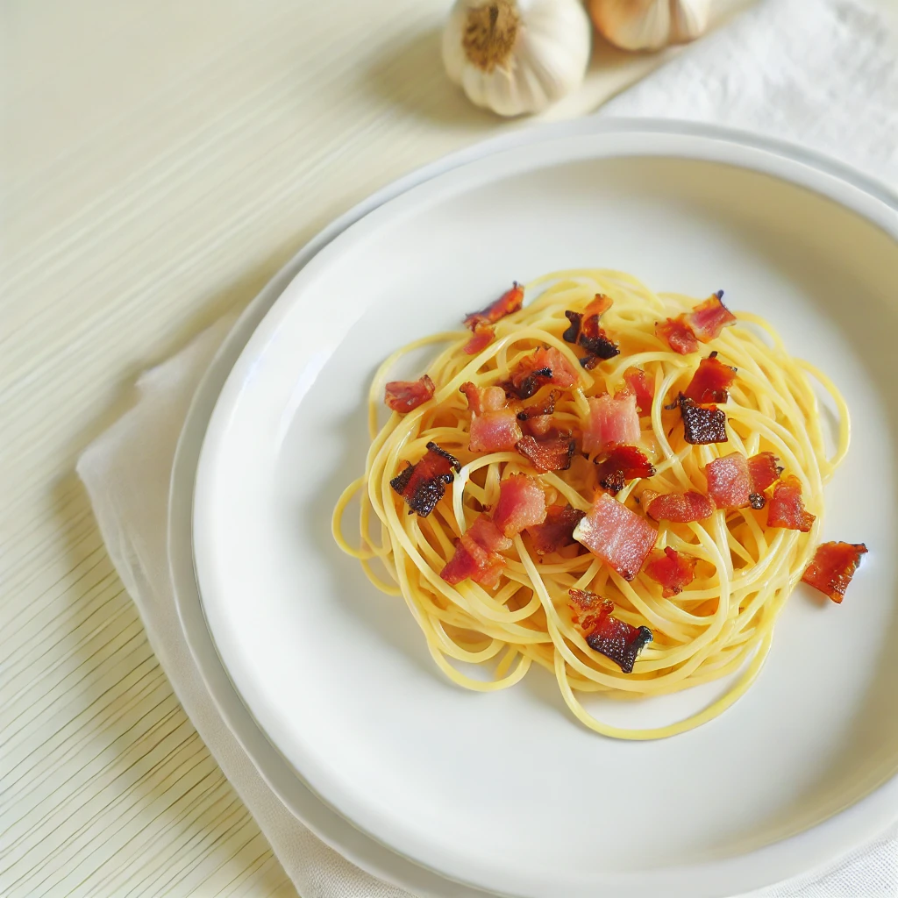

# ズボラなーラ（ズボラなカルボナーラ）レシピ

## はじめに

[カルボナーラ](https://ja.wikipedia.org/wiki/%E3%82%AB%E3%83%AB%E3%83%9C%E3%83%8A%E3%83%BC%E3%83%A9)はイタリア料理の定番ですが、忙しい人や料理が苦手な人でも簡単に作れる「ズボラなーラ（ズボラなカルボナーラ）」をご紹介します。このレシピなら手間をかけずに美味しいパスタを楽しめます。

私がズボラなーラに込めた想いは[こちら](origin.md)

## 必要な材料

- パスタ 100g
- ベーコン 50g
- ニンニク 1片
- 卵 1個
- 粉チーズ 大さじ2
- オリーブオイル 大さじ1
- 塩 適量
- コショウ 適量

## 手順

1. **パスタを電子レンジで茹でる**
   - 耐熱容器にパスタとパスタが浸るくらいの水、塩ひとつまみを入れます。
   - ラップをして電子レンジでパスタの表示時間＋2分加熱します。

2. **ベーコンとガーリックを炒める**
   - ベーコンを食べやすい大きさに切り、ニンニクをみじん切りにします。
   - フライパンにオリーブオイルを熱し、ベーコンの旨みとニンニクの香りをオイルに移します。

3. **ソースを準備する**
   - ボウルに生卵と粉チーズを入れてます。
   - この時にはまだ卵を混ぜないでください！
   - コショウで味を調えます（塩はベーコンとチーズの塩分があるので控えめに）。

4. **パスタとソースを合わせる**
    - 茹で上がったパスタの水気を切り、熱々のままボウルに入れます。
    - パスタの余熱で卵に軽く火を通しながら、全体をよく混ぜます。

5. **仕上げ**
    - パスタをお皿に盛り付け、上から炒めたベーコンとガーリックを乗せます。
    - お好みで追加の粉チーズやコショウを振りかけて完成です。

## 補足
### さらに美味しくするコツ
- **カツオの顆粒出汁**をソースに入れると和風な味わいになります
- 生卵を使用するので、**新鮮な卵**を使うと安心です。
- オイルにパスタの茹で汁を少し入れてあげると、パスタとよくなじみます。
- **新鮮なパセリ**を刻んで散らす
- **ホールブラックペッパー**をミルを使ってかけてるとより風味が際立ちます

### さらにズボラにするコツ
- 正直、フライパンなしで，具材なしボーラにしても美味しいです。

## 終わりに
この「ズボラなーラ」で、手軽に本格的なカルボナーラの味を楽しんでみてください。
作ってみたよと言う人はぜひ`@Tom-atok`にご連絡ください！
